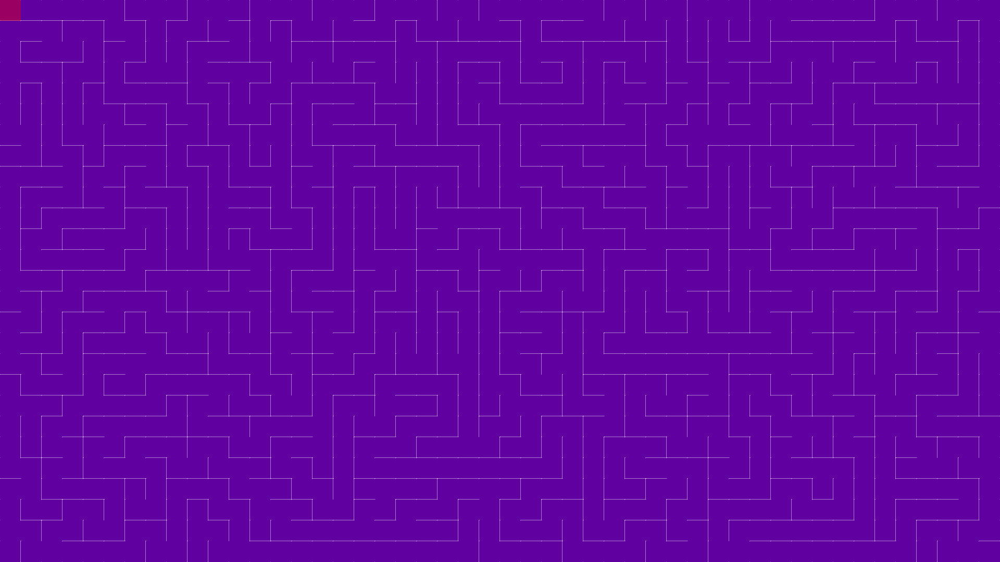

# Maze-Generator

## Table of Contents

-   [Description](#description)
-   [Dependencies](#dependencies)
-   [Presentation](#presentation)

## Description

This is a maze generator using the recursive backtracking algorithm. It is written in javascript and uses the p5.js library for the graphics.

The depth-first search algorithm of maze generation is frequently implemented using backtracking. This can be described with a following recursive routine:

1. Given a current cell as a parameter
2. Mark the current cell as visited
3. While the current cell has any unvisited neighbour cells
    1. Choose one of the unvisited neighbours
    2. Remove the wall between the current cell and the chosen cell
    3. Invoke the routine recursively for the chosen cell

which is invoked once for any initial cell in the area.
[Wikipedia](https://en.wikipedia.org/wiki/Maze_generation_algorithm#Randomized_depth-first_search)

## Dependencies

-   [p5.js](https://p5js.org/)

## Presentation

